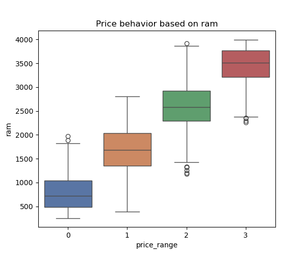

# Mobile phones business analysis and supervised machine learning algorithms (price category prediction)
> :loudspeaker: Algorithm descriptions were taken from ChatGPT and summarized
## 1.Introduction
In the competitive mobile device market, predicting the price of a product is essential for both manufacturers and consumers. This project focuses on developing a classification model based on various device features, ranging from technical specifications to functional characteristics. These variables include battery_power, clock_speed, internal memory, device weight, and more. By considering multiple attributes, we can capture the market's complexity and provide accurate estimates of the device's price.

The variety of features considered, from battery capacity to the presence of technologies like 4G or Wi-Fi connectivity, allows us to explore how these aspects affect the device's market price. Using machine learning techniques, our goal is to build a robust classification model that can accurately predict the price category to which a device belongs based on its technical and functional characteristics. This will provide manufacturers and consumers with an invaluable tool for making informed decisions in the competitive world of mobile devices.

## 2. Data Collection and Preprocessing
Importing necessary libraries
```python
import pandas as pd
import numpy as np
from sklearn.model_selection import train_test_split, GridSearchCV
import matplotlib.pyplot as plt
from sklearn.tree import DecisionTreeClassifier
from sklearn.ensemble import RandomForestClassifier, VotingClassifier,AdaBoostClassifier
from xgboost import XGBClassifier
from sklearn.svm import SVC
from sklearn.neighbors import KNeighborsClassifier
```
Importing table with column names
```python
df = pd.read_csv('./data/CellPhone_train.csv')
# https://www.kaggle.com/datasets/atefehmirnaseri/cell-phone-price
df.head()
```
In this case, as the data is already clean, a data clean is not necessary
## 3. Exploratory Data Analysis (EDA)
### Price Trend Based on ram(with Box Plot)
We import seaborn and create a plot with "range_price" on the X-axis and "ram" on the Y-axis.  

  

In this case, it was observed that the correlation between RAM and price was the only determinant, and as can be seen in this box plot, despite the outliers, the boxes tend to exhibit a normal behavior according to the price range.

## 4. Prediction based on supervised algorythm
For greater model accuracy, the data was divided into training data and input data to detect overfitting and determine which model best predicted the new data.
```python
X_train, X_test, Y_train, Y_test = train_test_split(df.loc[:,:'price_range'],df['price_range'],test_size=0.33,random_state=42)
```
For this classification case, a multivariable analysis was chosen using all columns to evaluate all components together for price prediction. The variable to be predicted is the price, classified into ranges from 0 to 4, where 0 is the lowest price and 4 is the highest.

As predictive models, the Decision Tree Classifier, Random Forest, KNeighbors Classifier, XGBoost Classifier, and AdaBoost Classifier were used. In this case, the GridSearch method was used to find the best hyperparameters for each model to achieve better predictions.
### Decission Tree Classifier
The DecisionTree classifier is a machine learning model that predicts outcomes by dividing data into subsets based on decisions made at nodes. Each node represents a feature, and branches represent possible values. It is straightforward to interpret and handles both categorical and continuous variables, although it can overfit if not properly controlled.  
**Accuracy**: 0.792

### Random Forest Classifier
The Random Forest classifier is a machine learning model that utilizes multiple decision trees to enhance accuracy and prevent overfitting. Each tree is trained on a random sample of the dataset, and predictions are determined by majority vote or average of results from all trees. This robust technique improves generalization and prediction stability.
**Accuracy**: 0.876

### KNeighbors Classifier
The KNeighbors classifier is a proximity-based machine learning model. To predict the class of a sample, the model identifies the 'k' nearest training points and assigns the most common class among them. It is straightforward, non-parametric, and effective for classification problems, although its performance can be affected by noisy data and the choice of the 'k' value.  
**Accuracy**: 0.936

### XGboost Classifier
The XGBoost classifier is a powerful machine learning model based on the boosting method. It constructs a series of decision trees, where each new tree corrects the errors of the previous ones. It utilizes regularization techniques to enhance accuracy and prevent overfitting. XGBoost is renowned for its high efficiency, flexibility, and superior performance in competitions and real-world applications.  
**Accuracy**: 0.912

### Adaboost Classifier
The AdaBoost classifier is a machine learning model that combines multiple weak classifiers, typically simple decision trees, to create a strong classifier. It works by iteratively adjusting the weights of samples, focusing more on those that were classified incorrectly in previous iterations. This allows for improved accuracy and reduced overfitting. AdaBoost is efficient and performs well across a variety of data and classification problems.  
**Accuracy**: 0.968

After training and testing all the aforementioned models, evaluating their accuracy, here are the results:
<div style="width:100%;display:flex;justify-content:center">
    <table>
        <thead>
            <th>Model</th>
            <th>Accuracy</th>
            <th>F1 score</th>
        </thead>
        <tbody>
            <tr>
                <td>Decission Tree Classifier</td>
                <td>0.792</td>
                <td>0.794</td>
            </tr>
            <tr>
                <td>Random Forest Classifier</td>
                <td>0.876</td>
                <td>0.875</td>
            </tr>
            <tr>
                <td>KNeighbors Classifier</td>
                <td>0.936</td>
                <td>0.936</td>
            </tr>
            <tr>
                <td>XGboost Classifier</td>
                <td>0.912</td>
                <td>0.912</td>
            </tr>
            <tr>
                <td>Adaboost Classifier</td>
                <td>0.968</td>
                <td>0.968</td>
            </tr>
        </tbody>
    </table>
</div>